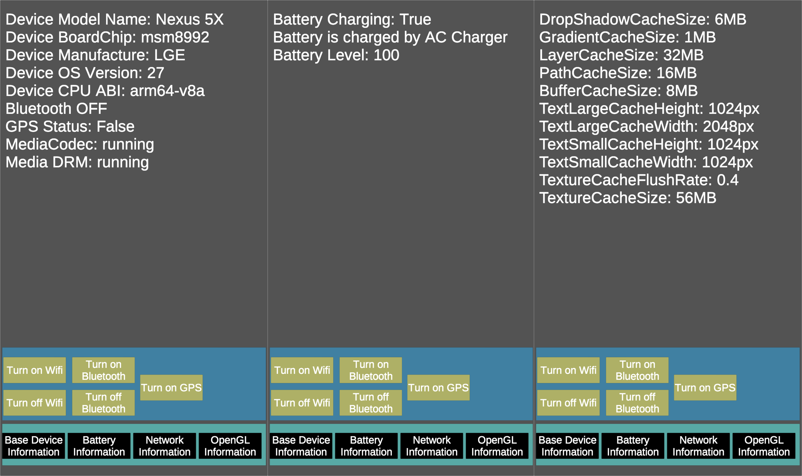

# AndroidDeviceScanner Unity Plugin
The AndroidDeviceScanner is the unity plugin that can getting android device information & control some of device sensors

This Asset enables unity developer to easily getting android device information(Device Model, Device Manufacturer, Device CPU Architecture, Whether the device is connected on internet or not, ... etc) and control the device's sensor(can turn on the wifi, off the wifi, ... etc)



## Specs
- AndroidDeviceScanner is UnityPlugin and is only available on Android platform.
- AndroidDeviceScanner support android minSdkVersion 4.4(API Level 19) above.

## Developer Guide
- Step1] Making <i>AndroidDeviceScanCore</i> Instance
```
private AndroidDeviceScanCore deviceScan;
……
deviceScan = new AndroidDeviceScanCore();

```
- Step2] Using AndroidDeviceScanCore's function that you need
```
deviceScan.GetDeviceModelName();    // Get Device Model
deviceScan.GetBluetoothStatus();         // Get Device Bluetooth Status
```

## API Guide
API Guide Documentation included the asset

## Download
Evaluating now....